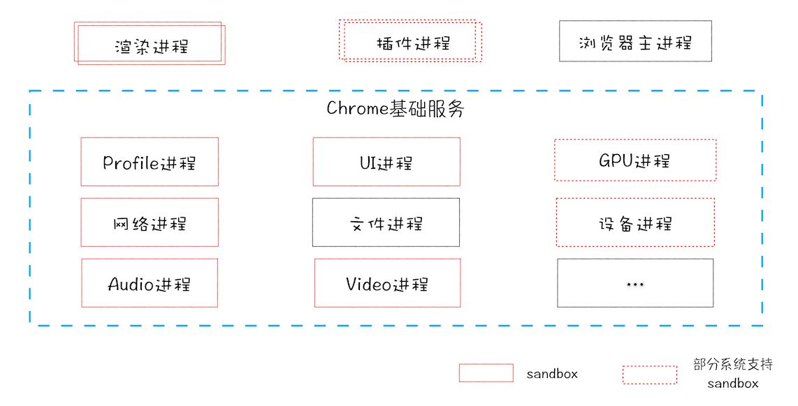
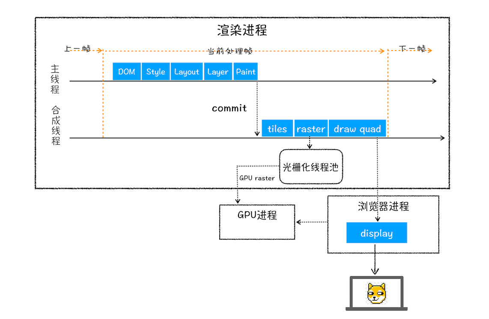

# 仅仅打开了1个页面，为什么有4个进程？
1. 单进程浏览器时代：单进程浏览器是指浏览器的所有功能模块都是运行在同一个进程里

   - 2007年之前，市面上浏览器都是单进程的
   - 不稳定： 插件,渲染引擎的崩溃也会导致整个浏览器的崩溃
   - 不流畅： js脚本，插件，页面内存泄漏也会使单进程变慢
   - 不安全： 插件可以获取到操作系统的任意资源，盗取密码，释放病毒等
2. 早期多进程浏览器时代
  
   - 进程是相互隔离的，通过IPC通讯
   - 稳定： 进程相互隔离，一个页面崩溃不会影响整个浏览器崩溃
   - 流畅： 影响的也是当前页面
   - 安全： Chrome 把插件进程和渲染进程锁在安全沙箱里面，恶意程序也无法突破沙箱去获取系统权限
3. 目前多进程

   - 浏览器进程： 显示、用户交互、子进程管理，同时提供存储等功能
   - 渲染进程
   - GPU进程： Chrome 的 UI 界面都选择采用 GPU 来绘制
   - 网络进程
   - 插件进程
4. 凡事都有两面性，多进程模型提升了浏览器的稳定性、流畅性和安全性，但不可避免的带来了一些问题
   - 更高的资源占用
   - 更复杂的体系架构：Chrome 试图应用到更多业务场景，如移动设备、VR、视频等，为了支持这些场景，Chrome 的架构体系变得越来越复杂
5. 未来面向服务的架构

   - Chrome 最终要把 UI、数据库、文件、设备、网络等模块重构为基础服务，类似操作系统底层服务
   - 目前处在多进程架构向面向服务的架构阶段

# TCP协议：如何保证页面文件能被完整送达浏览器？
1. 互联网中的数据是通过数据包来传输的，数据包在传输过程中容易丢失或出错
2. IP(Internet Protocol)：把数据包送达目的*主机*
3. UDP(用户数据包协议User Datagram Protocol)：把数据包送达应用程序
   - 并根据 UDP 中所提供的*端口号*，把数据部分交给上层的应用程序；
   - 虽说 *UDP 不能保证数据可靠性，但是传输速度却非常快*，所以 UDP 会应用在一些关注速度、但不那么严格要求数据完整性的领域，如在线视频、互动游戏等。
4. TCP（Transmission Control Protocol，传输控制协议）：把数据完整地送达应用程序

   - 是一种面向连接的、可靠的、基于字节流的传输层通信协议
   - 对于数据包丢失的情况，TCP 提供重传机制
   - TCP 引入了数据包排序机制，用来保证把乱序的数据包组合成一个完整的文件
   - TCP 为了保证数据传输的可靠性，牺牲了数据包的传输速度，因为“三次握手”和“数据包校验机制”等把传输过程中的数据包的数量提高了一倍。

# HTTP请求流程：为什么很多站点第二次打开速度会很快？
#### 浏览器端发起 HTTP 请求流程
1. 构建请求
2. 查找缓存
   - 缓解服务器端压力，提升性能
   - 对于网站来说，缓存是实现快速资源加载的重要组成部分
3. 准备 IP 地址和端口
   - DNS(Domain Name System): 负责把域名和 IP 地址做一一映射关系。这套域名映射为 IP 的系统就叫做“域名系统”。
   - 第一步浏览器会请求 DNS 返回域名对应的 IP。当然浏览器还提供了 DNS 数据缓存服务
4. 等待 TCP 队列
   - Chrome 有个机制，同一个域名同时最多只能建立 6 个 TCP 连接，超过会等待
5. 建立 TCP 连接
6. 发送 HTTP 请求

#### 服务器端处理 HTTP 请求流程
1. 返回请求
2. 断开连接
   - Connection:Keep-Alive。保持 TCP 连接可以省去下次请求时需要建立连接的时间，提升资源加载速度
3. 重定向

#### *DNS 缓存*和*页面资源缓存*这两块数据是会被浏览器缓存的


#### http请求示意图


# 渲染流程: HTML、CSS和JavaScript，是如何变成页面的？
1. 构建DOM树
   - 把html转化为浏览器可理解的结构

2. 样式计算（Recalculate Style)
   - 将 CSS 文本转换为浏览器可以理解的结构——styleSheets。

   - 转换样式表中的属性值，使其标准化
  
   - 计算出 DOM 树中每个节点的具体样式(CSS 的继承规则和层叠规则)
3. 布局阶段

   - 生成布局树
   - 遍历 DOM 树中的所有可见节点，并把这些节点加到布局中；而不可见的节点会被布局树忽略掉，如 head 标签下面的全部内容，再比如 body.p.span 这个元素，因为它的属性包含 dispaly:none，所以这个元素也没有被包进布局树。
   - 布局计算
4. 分层
   - 渲染引擎还需要为特定的节点生成专用的图层，并生成一棵对应的图层树（LayerTree）

5. 图层绘制
   - 渲染引擎会对图层树中的每个图层进行绘制
6. 栅格化（raster）操作
   - 绘制操作是由渲染引擎中的合成线程来完成的
   - 所谓栅格化，是指将图块转换为位图
7. 合成和显示
   - 一旦所有图块都被光栅化，合成线程就会生成一个绘制图块的命令——“DrawQuad”，然后将该命令提交给浏览器进程
   - 浏览器进程里面有一个叫 viz 的组件，用来接收合成线程发过来的 DrawQuad 命令，然后根据 DrawQuad 命令，将其页面内容绘制到内存中，最后再将内存显示在屏幕上。

#### 渲染流水线
* 从 HTML 到 DOM、样式计算、布局、图层、绘制、光栅化、合成和显示


#### 重排，重绘，合成
1. 更新了元素的几何属性（重排）

   - 如果你通过 JavaScript 或者 CSS 修改元素的几何位置属性，例如改变元素的宽度、高度等，那么浏览器会触发重新布局，解析之后的一系列子阶段，这个过程就叫重排。
   - 重排需要更新完整的渲染流水线，所以开销也是最大的
2. 更新元素的绘制属性（重绘）

   - 如果修改了元素的背景颜色，那么布局阶段将不会被执行，因为并没有引起几何位置的变换，所以就直接进入了绘制阶段
   - 重绘省去了布局和分层阶段，所以执行效率会比重排操作要高一些。
3. 直接合成阶段

   - 我们使用了 CSS 的 transform 来实现动画效果，这可以避开重排和重绘阶段，直接在非主线程上执行合成动画操作。这样的效率是最高的
   - 相对于重绘和重排，合成能大大提升绘制效率。
4. 规则
   - 样式表越简单，重排和重绘就越快。
   - 重排和重绘的DOM元素层级越高，成本就越高。
   - table元素的重排和重绘成本，要高于div元素


#### 有那些具体的实践方法能减少重绘、重排呢？
1. DOM 的多个读操作（或多个写操作），应该放在一起。不要两个读操作之间，加入一个写操作
2. 某个样式是通过重排得到的，那么最好缓存结果。避免下一次用到的时候，浏览器又要重排。
3. 不要一条条地改变样式，而要通过改变class，或者csstext属性，一次性地改变样式。
```js
// bad
var left = 10;
var top = 10;
el.style.left = left + "px";
el.style.top  = top  + "px";

// good 
el.className += " theclassname";

// good
el.style.cssText += "; left: " + left + "px; top: " + top + "px;";
```
4. 先将元素设为display: none（需要1次重排和重绘），然后对这个节点进行100次操作，最后再恢复显示（需要1次重排和重绘）。这样一来，你就用两次重新渲染，取代了可能高达100次的重新渲染。
5. position属性为absolute或fixed的元素，重排的开销会比较小，因为不用考虑它对其他元素的影响。
6. 只在必要的时候，才将元素的display属性为可见，因为不可见的元素不影响重排和重绘。另外，visibility : hidden的元素只对重绘有影响，不影响重排。
7. 使用虚拟DOM的脚本库，比如React等。