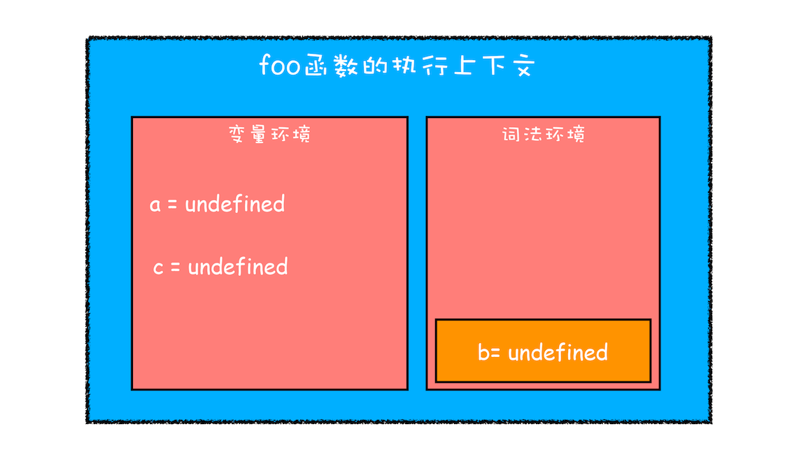
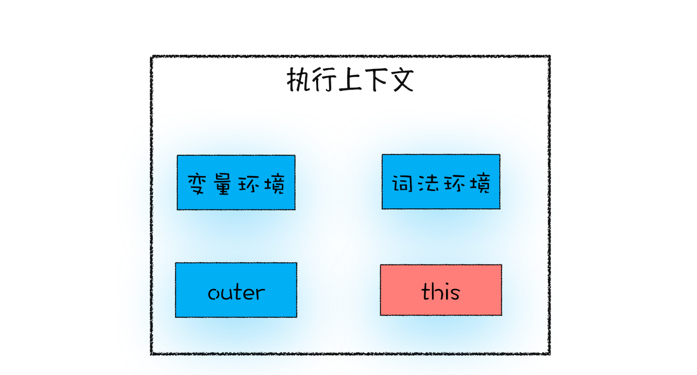

# JS执行过程？

1. JavaScript 代码执行过程中，需要先做变量提升，而之所以需要实现变量提升，是因为 JavaScript 代码在执行之前需要先编译。
2. 在编译阶段，变量和函数会被存放到*变量环境*中，变量的默认值会被设置为 undefined；在代码执行阶段，JavaScript 引擎会从变量环境中去查找自定义的变量和函数。
3. 一段代码如果定义了两个相同名字的函数，那么最终生效的是最后一个函数。
4. JavaScript 的执行机制：先编译，再执行。
5. eg:
```js
    showName()
    var showName = function() {
        console.log(2)
    }
    function showName() {
        console.log(1)
    }
    // VariableEnvironment
    var showName = undefined;
    var showName = function(){ console.log(1) }
    // 可执行代码
    showName()
    showName = function () { console.log(2) }
```
# 调用栈：为什么JavaScript代码会出现栈溢出？
1. 什么是栈？
   - 栈就是类似于一端被堵住的单行线，在车流量较大的场景中，就会发生反复的入栈、栈满、出栈、空栈和再次入栈，一直循环。

2. 什么是 JavaScript 的调用栈?
   - JavaScript 引擎正是利用栈的这种结构来管理执行上下文的, 被称为执行上下文栈，又称调用栈。
   - 调用栈是 JavaScript 引擎追踪函数执行的一个机制
```js
var a = 2
function add(b, c){
    return b+c
}
function addAll(b, c){
    var d = 10
    result = add(b,c)
    return a + result + d
}
addAll(3,6)
```

  -  变量 a、函数 add 和 addAll 都保存到了全局上下文的变量环境对象中。
  -  第二步是调用 addAll 函数,当调用该函数时，JavaScript 引擎会编译该函数，并为其创建一个执行上下文，最后还将函数的执行上下文压入栈中
  -  当执行到 add 函数调用语句时，同样会为其创建执行上下文，并将其压入调用栈
  -  当函数执行完毕后，函数的执行上下文就会从栈顶弹出。
  -  最后，调用栈中就只剩下全局上下文了
3. 在开发中，如何利用好调用栈
   - 浏览器中查看 call stack
   - console.trace()

4. 栈溢出
   - *调用栈是有大小的*，当入栈的执行上下文超过一定数目，JavaScript 引擎就会报错，我们把这种错误叫做*栈溢出*。
   - 这个函数是递归的，并且没有任何终止条件，所以它会一直创建新的函数执行上下文，最终栈溢出
```js
function division(a,b){ 
    return division(a,b)
}
console.log(division(1,2))
```
   - 修改递归，防止栈溢出
```js
function runStack (n) { 
    if (n === 0) return 100; 
    return runStack( n- 2);
}
runStack(50000)

// 优化
function runStack(n) {
    while (true) {
        if (n === 0) {
            return 100;
        }
        if (n === 1) { // 防止陷入死循环
            return 200;
        }
        n = n - 2;
    }
}
runStack(50000)
```

# 块级作用域：var缺陷以及为什么要引入let和const？
1. 变量提升带来的问题
   - 变量容易在不被察觉的情况下被覆盖掉
```js
var myname = "极客时间"
function showName(){ 
    console.log(myname); 
    if(0){ 
        var myname = "极客邦" 
    } 
    console.log(myname);
}
```
   - 本应销毁的变量没有被销毁
```js
function foo() {
    for (var i = 0; i < 7; i++) {

    }
    console.log(i);
}
foo()
```
2. ES6 引入了 let 和 const 关键字解决变量提升带来的问题
```js
function foo(){ 
    var a = 1 
    let b = 2 
    { 
        let b = 3 
        var c = 4 
        let d = 5 
        console.log(a) 
        console.log(b) 
    } 
    console.log(b) 
    console.log(c) 
    console.log(d)
} 
foo()
```
* 一. 创建执行上下文

  - 函数内部通过 var 声明的变量，在编译阶段全都被存放到变量环境里面了
  - 通过 let 声明的变量，在编译阶段会被存放到词法环境（Lexical Environment）中
  - ****在函数的作用域内部{}，通过 let 声明的变量并没有被存放到词法环境****中

* 二. 执行代码

  - 在词法环境内部，维护了一个小型栈结构，栈底是函数最外层的变量，进入一个作用域块后，就会把该作用域块内部的变量压到栈顶；当作用域执行完成之后，该作用域的信息就会从栈顶弹出,(通过let，const声明的变量)
  - 变量查找过程


3. 扩展
```js
let myname = '极客时间' 
{
   console.log(myname) 
   let myname = '极客邦'
}
// Uncaught ReferenceError: Cannot access 'myname' before initialization
```
   * 分析原因】：在块作用域内，let声明的变量被提升，但变量只是创建被提升，初始化并没有被提升，在初始化之前使用变量，就会形成一个暂时性死区
   - var的创建和初始化被提升，赋值不会被提升
   - let的创建被提升，初始化和赋值不会被提升
   - function的创建、初始化和赋值均会被提升

# 作用域链
```js
function bar() {
    console.log(myName)
}
function foo() {
    var myName = "极客邦"
    bar()
}
var myName = "极客时间"
foo()
```

1. 其实在每个执行上下文的变量环境中，都包含了一个外部引用，用来指向外部的执行上下文，我们把这个外部引用称为 outer。
2. 我们把通过作用域查找变量的链条称为作用域链

# 从JavaScript执行上下文的视角看this
```js
var bar = {
    myName:"time.geekbang.com",
    printName: function () {
        console.log(myName)
    }    
}
bar.printName()
```
1. 在对象内部的方法中使用对象内部的属性是一个非常普遍的需求。但是 JavaScript 的作用域机制并不支持这一点，基于这个需求，JavaScript 又搞出来另外一套 this 机制。
2. this是什么

  - this 是和执行上下文绑定的
  - 执行上下文主要分为三种——全局执行上下文、函数执行上下文和 eval 执行上下文，所以对应的 this 也只有这三种——全局执行上下文中的 this、函数中的 this 和 eval 中的 this。

3. this指向
   - 当函数作为对象的方法调用时，函数中的 this 就是该对象；
   - 当函数被正常调用时，在严格模式下，this 值是 undefined，非严格模式下 this 指向的是全局对象 window
   - 通过 new 关键字构建好了一个新对象，并且构造函数中的 this 其实就是新对象本身。
   - 嵌套函数中的 this 不会继承外层函数的 this 值。
4. this 的设计缺陷以及应对方案
```js
var myObj = {
  name : "极客时间", 
  showThis: function(){
    console.log(this)
    function bar(){
        console.log(this)
    }
    bar()
  }
}
// 解决方案
var myObj = {
  name : "极客时间", 
  showThis: function(){
    console.log(this)
    // const self = this
    // function bar(){
    //     console.log(self)
    // }
    const bar = () => {
        console.log(this)
    }
    bar()
  }
}
myObj.showThis()
```
   - 嵌套函数中的 this 不会从外层函数中继承;(第一种是把 this 保存为一个 self 变量，再利用变量的作用域机制传递给嵌套函数。第二种是继续使用 this，但是要把嵌套函数改为箭头函数，因为箭头函数没有自己的执行上下文，所以它会继承调用函数中的 this。)
   - 普通函数中的 this 默认指向全局对象 window(因为在实际工作中，我们并不希望函数执行上下文中的 this 默认指向全局对象。通过 call 方法来显示调用)