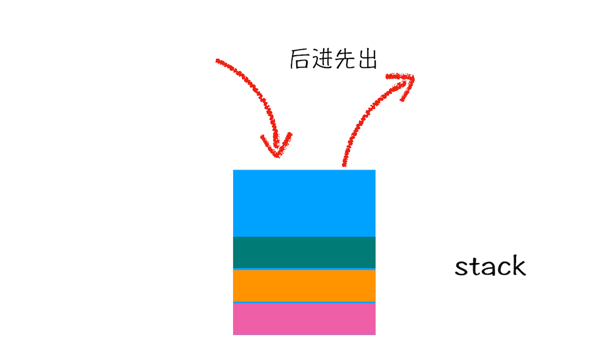
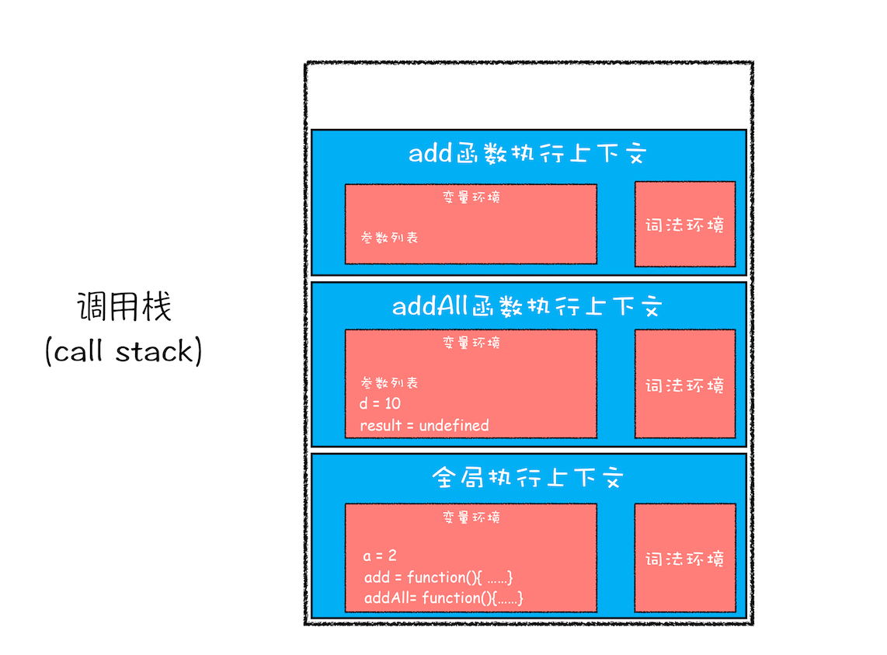

# JS执行过程？

1. JavaScript 代码执行过程中，需要先做变量提升，而之所以需要实现变量提升，是因为 JavaScript 代码在执行之前需要先编译。
2. 在编译阶段，变量和函数会被存放到*变量环境*中，变量的默认值会被设置为 undefined；在代码执行阶段，JavaScript 引擎会从变量环境中去查找自定义的变量和函数。
3. 一段代码如果定义了两个相同名字的函数，那么最终生效的是最后一个函数。
4. JavaScript 的执行机制：先编译，再执行。
5. eg:
```js
    showName()
    var showName = function() {
        console.log(2)
    }
    function showName() {
        console.log(1)
    }
    // VariableEnvironment
    var showName = undefined;
    var showName = function(){ console.log(1) }
    // 可执行代码
    showName()
    showName = function () { console.log(2) }
```
# 调用栈：为什么JavaScript代码会出现栈溢出？
1. 什么是栈？
   - 栈就是类似于一端被堵住的单行线，在车流量较大的场景中，就会发生反复的入栈、栈满、出栈、空栈和再次入栈，一直循环。

2. 什么是 JavaScript 的调用栈?
   - JavaScript 引擎正是利用栈的这种结构来管理执行上下文的, 被称为执行上下文栈，又称调用栈。
   - 调用栈是 JavaScript 引擎追踪函数执行的一个机制
```js
var a = 2
function add(b, c){
    return b+c
}
function addAll(b, c){
    var d = 10
    result = add(b,c)
    return a + result + d
}
addAll(3,6)
```

  -  变量 a、函数 add 和 addAll 都保存到了全局上下文的变量环境对象中。
  -  第二步是调用 addAll 函数,当调用该函数时，JavaScript 引擎会编译该函数，并为其创建一个执行上下文，最后还将函数的执行上下文压入栈中
  -  当执行到 add 函数调用语句时，同样会为其创建执行上下文，并将其压入调用栈
  -  当函数执行完毕后，函数的执行上下文就会从栈顶弹出。
  -  最后，调用栈中就只剩下全局上下文了
3. 在开发中，如何利用好调用栈
   - 浏览器中查看 call stack
   - console.trace()

4. 栈溢出
   - *调用栈是有大小的*，当入栈的执行上下文超过一定数目，JavaScript 引擎就会报错，我们把这种错误叫做*栈溢出*。
   - 这个函数是递归的，并且没有任何终止条件，所以它会一直创建新的函数执行上下文，最终栈溢出
```js
function division(a,b){ 
    return division(a,b)
}
console.log(division(1,2))
```
   - 修改递归，防止栈溢出
```js
function runStack (n) { 
    if (n === 0) return 100; 
    return runStack( n- 2);
}
runStack(50000)

// 优化
function runStack(n) {
    while (true) {
        if (n === 0) {
            return 100;
        }
        if (n === 1) { // 防止陷入死循环
            return 200;
        }
        n = n - 2;
    }
}
runStack(50000)
```
