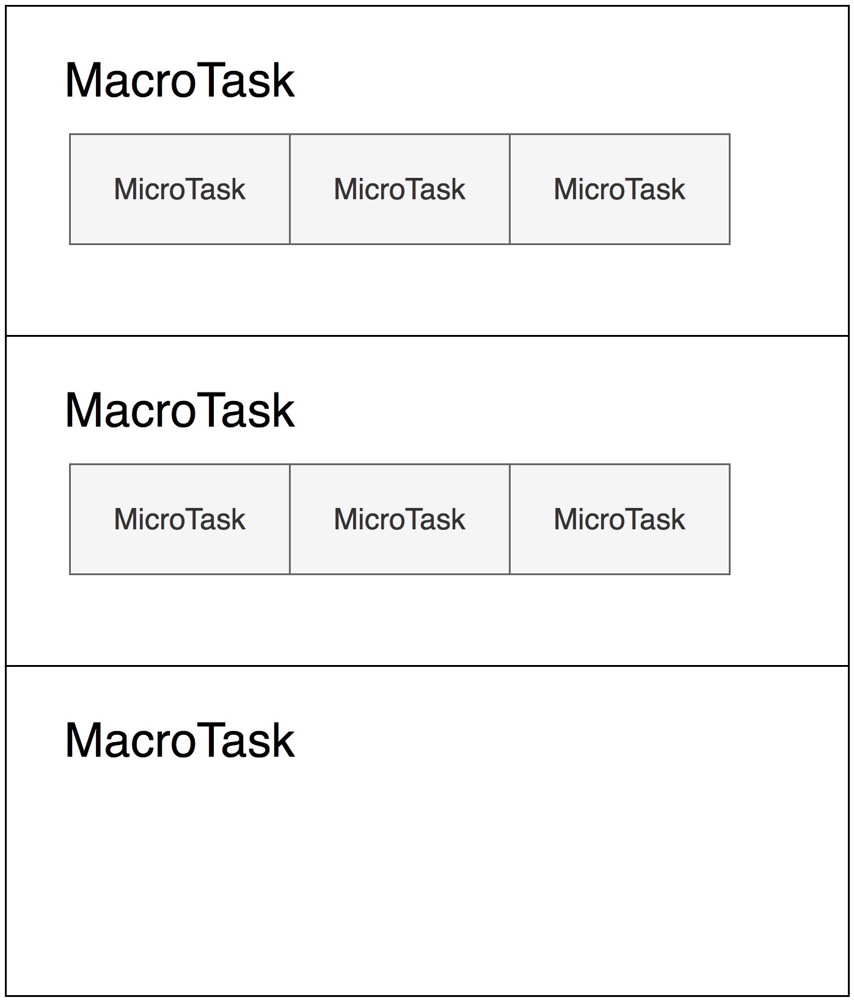
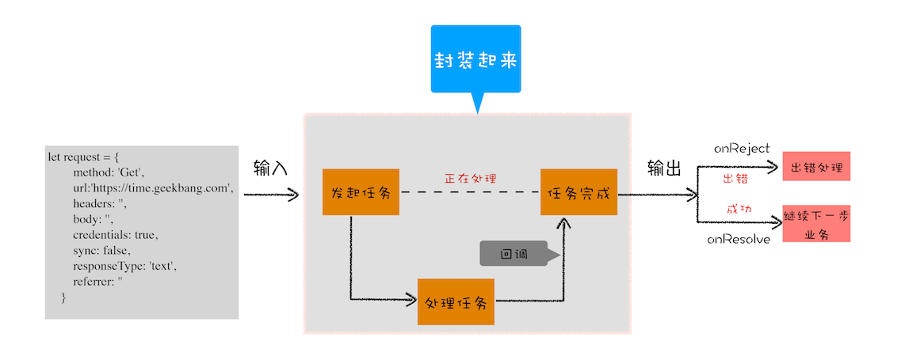
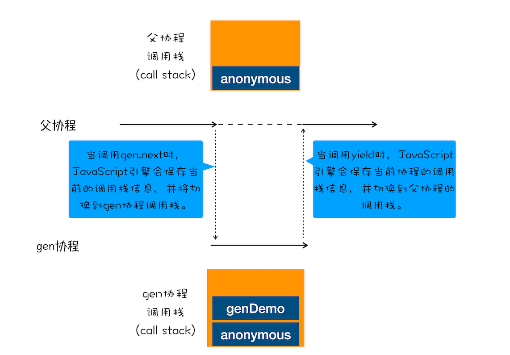

### 消息队列和事件循环


1. 消息队列（先进先出）中的任务是宏任务
2. 单线程的缺点
   - 如何处理高优先级的任务（微任务：权衡效率和实时性）
   - 如何解决单个任务执行时长过久的问题（回调）

### setTimeout
1. 使用 setTimeout 设置的回调函数中的 this 不符合直觉
```js
var name= 1;
var MyObj = {
  name: 2,
  showName: function(){
    console.log(this.name);
  }
}
setTimeout(MyObj.showName,1000)   // 1


//箭头函数
setTimeout(() => {
    MyObj.showName()   // 2
}, 1000);
//或者function函数
setTimeout(function() {
  MyObj.showName();  // 2
}, 1000)

setTimeout(MyObj.showName.bind(MyObj), 1000) // 2
```
2. 如果当前任务执行时间过久，会影延迟到期定时器任务的执行
### 微任务
1. 异步回调
   - 把异步回调函数封装成一个宏任务，添加到消息队列尾部，当循环系统执行到该任务的时候执行回调函数（setTimeout 和 XMLHttpRequest 的回调函数都是通过这种方式来实现的）
   - 把异步回调函数封装成一个微任务

2. 在一个宏任务中，分别创建一个用于回调的宏任务和微任务，无论什么情况下，微任务都早于宏任务执行。
3. 使用 Promise，当调用 Promise.resolve() 或者 Promise.reject() 的时候，也会产生微任务。
4. 我们把宿主发起的任务称为宏观任务，把 JavaScript 引擎发起的任务称为微观任务

# Promise
1. Web页面的单线程架构决定了异步回调
2. 异步回调的缺点
   - 代码逻辑不连续
```js
//执行状态
function onResolve(response){console.log(response) }
function onReject(error){console.log(error) }

let xhr = new XMLHttpRequest()
xhr.ontimeout = function(e) { onReject(e)}
xhr.onerror = function(e) { onReject(e) }
xhr.onreadystatechange = function () { onResolve(xhr.response) }

//设置请求类型，请求URL，是否同步信息
let URL = 'https://time.geekbang.com'
xhr.open('Get', URL, true);

//设置参数
xhr.timeout = 3000 //设置xhr请求的超时时间
xhr.responseType = "text" //设置响应返回的数据格式
xhr.setRequestHeader("X_TEST","time.geekbang")

//发出请求
xhr.send();
```
3. 解决方案
   - 封装异步代码，让处理流程变得线性（由于我们重点关注的是 ***输入内容（请求信息）和输出内容（回复信息）*** ，至于中间的异步请求过程，我们不想在代码里面体现太多，因为这会干扰核心的代码逻辑）
  
4. 在稍微复制点的场景下依然存在着回调地狱的问题
```js
XFetch(makeRequest('https://time.geekbang.org/?category'),
      function resolve(response) {
          console.log(response)
          XFetch(makeRequest('https://time.geekbang.org/column'),
              function resolve(response) {
                  console.log(response)
                  XFetch(makeRequest('https://time.geekbang.org')
                      function resolve(response) {
                          console.log(response)
                      }, function reject(e) {
                          console.log(e)
                      })
              }, function reject(e) {
                  console.log(e)
              })
      }, function reject(e) {
          console.log(e)
    })
```
   - 多层嵌套的问题；
   - 每种任务的处理结果存在两种可能性（成功或失败），那么需要在每种任务执行结束后分别处理这两种可能性。
5. Promise：消灭嵌套调用和多次错误处理
   - Promise 通过回调函数延迟绑定、回调函数返回值穿透和错误“冒泡”技术解决了上面的两个问题。
   - Promise 中使用微任务，解决了回调函数延迟绑定，又提升了代码的执行效率（比setTimeout快）
   - 使用resolved或rejected回调方法新建的一个promise对象，实现返回值穿透，链式调用
   - 因为 promise 内部的错误不会冒泡出来，而是被 promise 吃掉了，只有通过 promise.catch 才可以捕获,不能用try catch

6. 实现一个简易的promise
```js
function Bromise(executor) {
    var onResolve_ = null
    var onReject_ = null
     //模拟实现resolve和then，暂不支持rejcet
    this.then = function (onResolve, onReject) {
        onResolve_ = onResolve
    };
    function resolve(value) {
          // 延迟执行onResolve_， 保证Bromise.then先执行
          setTimeout(()=>{
            onResolve_(value)
           },0)
    }
    executor(resolve, null);
}
```

# async/await
### 生成器 VS 协程
```js
function* genDemo() {
    console.log("开始执行第一段")
    yield 'generator 2'

    console.log("开始执行第二段")
    yield 'generator 2'

    console.log("开始执行第三段")
    yield 'generator 2'

    console.log("执行结束")
    return 'generator 2'
}

console.log('main 0')
let gen = genDemo()
console.log(gen.next().value)
console.log('main 1')
console.log(gen.next().value)
console.log('main 2')
console.log(gen.next().value)
console.log('main 3')
console.log(gen.next().value)
console.log('main 4')
```
1. 生成器函数(Generator)是一个带星号函数，而且是可以 ***暂停执行yield*** 和 ***恢复执行next*** 的
2. 为什么可以暂停和恢复执行呢？
   - 那你首先要了解协程的概念
   - ***协程是一种比线程更加轻量级的存在***
   - 一个线程上可以存在多个协程，但是在线程上同时只能执行一个协程，比如当前执行的是 A 协程，要启动 B 协程，那么 A 协程就需要将主线程的控制权交给 B 协程，这就体现在 A 协程暂停执行，B 协程恢复执行
   - 通常，*** 如果从 A 协程启动 B 协程，我们就把 A 协程称为 B 协程的父协程 *** 。

3. 父协程和gen协程都有自己的调用栈。通过yeild和next 去切换和恢复协程时，是怎么切换调用栈的呢？
   - gen 协程和父协程是在主线程上交互执行的，并不是并发执行的，它们之前的切换是通过 yield 和 gen.next 来配合完成的
   - 当在 gen 协程中调用了 yield 方法时，JavaScript 引擎会保存 gen 协程当前的调用栈信息，并恢复父协程的调用栈信息。同样，当在父协程中执行 gen.next 时，JavaScript 引擎会保存父协程的调用栈信息，并恢复 gen 协程的调用栈信息

4. 生成器就是协程的一种实现方式，这样相信你也就理解什么是生成器了
5. 其实 async/await 技术背后的秘密就是 Promise 和生成器应用
6. async
   - async 是一个通过 ***异步执行***并 *** 隐式返回 Promise *** 作为结果的函数。
```js
async function foo() {
    return 2
}
console.log(foo())  // Promise {<resolved>: 2}
```
7. await
```js
async function foo() {
    console.log(1)
    let a = await 100
    console.log(a)
    console.log(2)
}
console.log(0)
foo()
console.log(3)
```
   - 当执行到await 100时，会默认创建一个 Promise 对象
```js
let promise_ = new Promise((resolve,reject){
  resolve(100)
})
```
